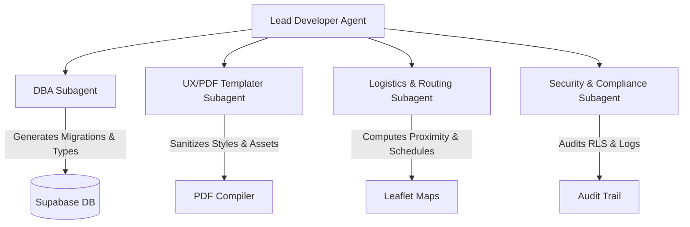

# AI Agent Project Briefing: Opus Form

This document provides a complete technical, architectural, and design overview of the **Opus Form** project. It is structured to help incoming AI agents rapidly build context, understand core patterns, and collaborate effectively.

---

## 1. Project Identity & Architecture
**Opus Form** is an industrial construction management application designed for high-pressure building sites. It handles job logging, labor scheduling, quote building, and safety/compliance audits.

* **Frontend**: React, TypeScript, Tailwind CSS, Vite.
* **Backend**: Supabase (PostgreSQL) with Row-Level Security (RLS) policies, triggers, and Deno-based Edge Functions.
* **Deployment**: Cloudflare Pages (`bun run build` via remote container) and locally hosted development instances.

---

## 2. Design System: "Dark Industrial"
UI elements must fit a rugged, functional aesthetic designed for mobile/tablet legibility on construction sites:
* **Backgrounds**: Deep Charcoal (`#1A1B1E`), Panel layers (`#1E1E1E`, `#222222`).
* **Accents**: Steel Blue (`#5C7285`).
* **Typography**: Uppercase, wide letter-spacing (`tracking-wider`), and small, dense font sizes (`8px` to `12px`).
* **Color Signals**:
  * **Amber**: Warning/Pending
  * **Red**: Critical/Blocked
  * **Emerald**: Cleared/Safe/Approved
* **Layout Rule**: Zero horizontal scrolling, tight padding, and strict mobile-first reactivity.

---

## 3. Database Schema & Security
The application connects to a standalone Supabase project ref `fgpthpxmiroyebrzjdzo`.

### Key Tables
1. **`public.profiles` / `public.staff`**:
   * Tracks administrative staff and site operatives (13 official company roles).
   * RLS restricts operatives from seeing rosters or sensitive data belonging to others.
2. **`public.quotes`**:
   * Stores customer estimates, line items, and terms.
3. **`public.jobs` & `public.shifts`**:
   * Manages logistics dispatching, locations, and time allocations.
4. **`public.audit_logs`**:
   * Chronologically records all operations (inserts, updates, deletes) across all core tables.
   * Includes a security-critical RPC/function pattern for reverting modifications directly from the UI.

### Supabase Vault Integration
* Sensitive credentials (like Resend SMTP settings) are stored encrypted in `vault.secrets`.
* Resolved dynamically by database triggers/functions via the restricted `public.decrypted_smtp_config` view.

---

## 4. Key Implementation Patterns

### Core State & Hydration
* **Global State**: Managed via `src/context/PortalContext.tsx`.
* **State Hydration**: Uses a serialization ref-locked 50ms hydration delay to prevent layout-time double-writes to the database on initial mount.

### PDF & Email Compilation
* **Client-Side PDF**: Compiled via `html2pdf.js`.
* **CSS Sanitization**: Programmatically clones target DOM nodes and strips modern CSS values (like `oklch()`) that crash the `html2canvas` parser before rendering.
* **Email Delivery**: Offloaded to a Supabase Edge Function (`supabase/functions/send-quote-pdf`) using the Resend HTTP API to bypass standard SMTP throttling.

---

## 5. Collaboration Guide for Supplementary Agents
When generating or invoking additional specialized agents, configure them with the following prompt-level boundaries:

1. **DBA Agent Instruction**:
   * *Scope*: Write migrations in `supabase/migrations/`, verify RLS policies, and generate TypeScript types.
   * *Rule*: Always fetch the current schema using `list_tables` before proposing table alters.
2. **PDF & Templating Agent Instruction**:
   * *Scope*: Style quotes and print sheets under `src/components/quotes/`.
   * *Rule*: Lock PDF export frame boundaries to exactly `794px x 1122px` (A4 standard) to avoid page-break offsets.
3. **Compliance & Audit Agent Instruction**:
   * *Scope*: Audit `public.audit_logs` and verify RLS boundaries.
   * *Rule*: Ensure all destructive actions (such as worker or quote deletion) trigger warning modal overlays before processing.
